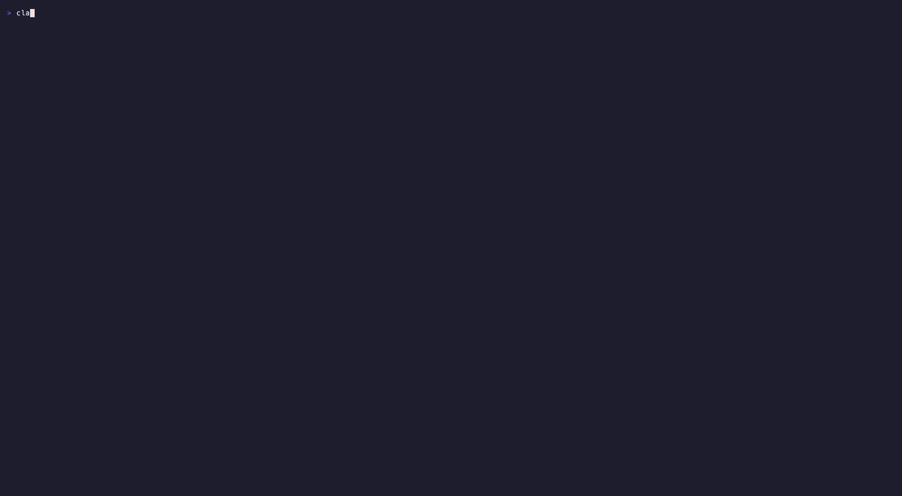

# Codebase Galaxy



[Watch the MP4](https://github.com/ccdwyer/claude-mods/raw/main/media/codebase-galaxy.mp4) · [Screenshot](media/01-galaxy.png) · [Screenshot](media/02-comet.png)

Your repo as a live, force-directed starfield in braille, inside Claude Code.

- **Stars are files.** Colour is the language, brightness is the file's size, and each folder (two levels deep, like `src/ui`) is its own star system.
- **Faint dotted threads are imports.** TypeScript/JavaScript (relative imports, and `@/` or `~/` read as `src/`), Python (relative and package imports) and Kotlin/Java (matched by package path) are parsed. Swift, Go, Rust and the rest still get stars and systems, but no links.
- **Claude is the comet.** Every Read, Edit, Write, or shell command that names a file sends the comet flying there with a fading tail. Edits flare amber, reads ping cyan, commands pulse green. Files Claude creates, or touches outside the scanned set, appear as new stars.
- It animates at about 30 fps on the pane's own frame clock: the layout settles live, stars twinkle, dust drifts behind it all.

## Use

```
/galaxy          open the galaxy (scans the repo the first time)
/galaxy rescan   rescan after big changes
```

In the pane: click it to give it the keyboard, then

| Key / mouse | Does |
|---|---|
| ← ↑ ↓ → or drag | pan |
| `+` / `-` | zoom |
| `0` | fit everything again |
| `f` | follow the comet |
| `r` | re-heat the layout |
| hover a star | show its path |
| click a star | copy its path |

Big repos are capped at 600 stars, picked round-robin across systems so every one shows up, plus up to 100 more for files Claude touches. The scan skips `node_modules`, build output, caches, dotfolders and symlinked folders, and stops at fixed budgets; a status of `of 2001+` means the scan was cut short. Surfaces without interactive views (mobile, VS Code) get a text chart of the systems instead.

## Install

```
/plugin marketplace add ccdwyer/claude-mods
/plugin install codebase-galaxy@ccdwyer-mods
/reload-plugins
```

## Develop

```
claude plugin validate .
claude plugin test .
```

## Privacy

It runs entirely on your machine and sends nothing over the network. It lists your repo's folders and reads up to a few hundred source files only to find import links, and runs no programs.

Full policy: [PRIVACY.md](PRIVACY.md).

## What it hooks

Events this mod hooks, as `claude plugin validate` reads the module:

- `session.start`
- `command.run{command=galaxy}`
- `tool.call`
- `ui.message`
- `ui.render{component=Pane, requestId=codebase-galaxy}`

Engine calls it makes: `$.command.register`, `$.fs.exists`, `$.fs.list`, `$.fs.read`, `$.session.cwd`, `$.state.get`, `$.state.set`, `$.ui.copy`, `$.ui.open`, `$.ui.resolve`, `$.ui.toast`.

A `tool.call` hook sits in the middle of every tool call: it can see the call, refuse it, or add context to its result. This mod only watches successful calls to move the comet; it never changes or refuses one.

## License

MIT
